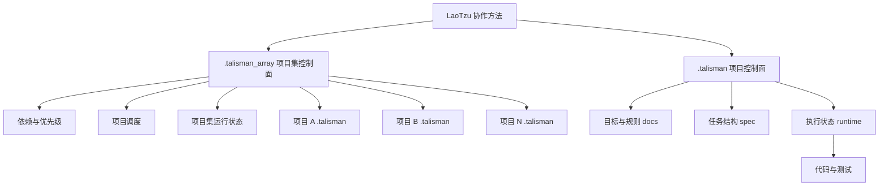

# 架构总览

## 1. LaoTzu 是做什么的

LaoTzu 是一套 AI 协作开发方法，用来把目标、规则、任务、状态组织成稳定结构，确保 AI 先理解意图，再执行变更。

它不是某个单一工具，也不绑定某个特定运行时，而是一套适用于真实项目与复合项目的协作控制面方法。

## 2. 两个层级的关系

LaoTzu 有两个控制层级：

1. `.talisman`：项目级控制面，负责单项目目标、规则、任务与状态。
2. `.talisman_array`：项目集控制面，负责多项目依赖、优先级、调度与收尾。

关系原则：

1. 项目集层决定谁先做、谁等待、谁收尾。
2. 项目层决定具体改什么代码、怎么验证。
3. 两层状态都要回写，且不能互相矛盾。

## 3. 架构图

## 4. 最小工作流

单项目流程：

1. 在真实项目根目录接入 `.talisman`。
2. AI 先读 `架构总览.md`、`AGENTS.md`、`docs/`。
3. 再按 `spec/tasks.yaml` 或任务文档执行。
4. 最后回写 `runtime/`。

复合项目流程：

1. 在复合项目根目录接入 `.talisman_array`。
2. AI 先读 `架构总览.md`、`AGENTS.md`、`docs/`、`spec/`。
3. 先确定项目顺序、依赖关系与调度策略。
4. 再进入各项目 `.talisman` 执行具体任务。
5. 最后同时回写项目级与项目集级 runtime。

## 5. 仓库关系

LaoTzu 相关仓库可以分成两类：模板仓库与示例仓库。

1. `talisman_template`：单项目模板，用于派生项目专用 `.talisman` 仓库。
2. `talisman_array_template`：复合项目模板，用于派生项目专用 `.talisman_array` 仓库。
3. `talisman_template_project`：单项目示例仓库，展示 `.talisman` 的落地方式。
4. `talisman_array_template_projects`：复合项目示例仓库，展示 `.talisman_array` 如何编排多个项目。

理解方式：

1. `template` 提供标准结构。
2. `project` 或 `projects` 提供落地示例。
3. `.talisman` 管一个项目。
4. `.talisman_array` 管一组项目。

## 6. 喂给 AI 的最小流程

1. 把 `.talisman` 或 `.talisman_array` 目录给 AI。
2. 要求 AI 先读本文件与 `AGENTS.md`。
3. 要求 AI 先总结目标、边界、ready 任务，再动手。
4. 要求 AI 执行后回写 `runtime/state.yaml` 或对应运行态文件。

## 7. 边界与约束

1. 不跳过规则直接改代码。
2. 不改禁改目录。
3. 不在依赖未满足时抢跑下游项目。
4. 每轮执行都必须可追踪、可回放、可复盘。

## 8. 文档维护原则

本文件在 `.talisman` 与 `.talisman_array` 中必须保持同一份内容语义，不做分叉版本。
